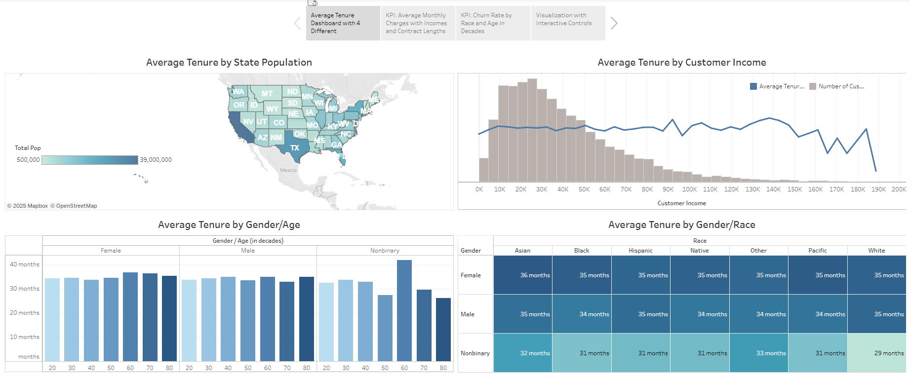
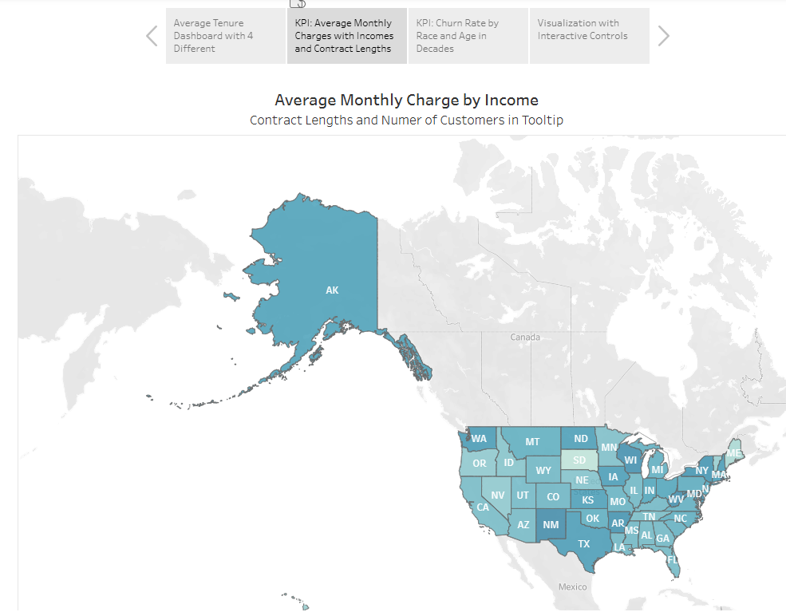
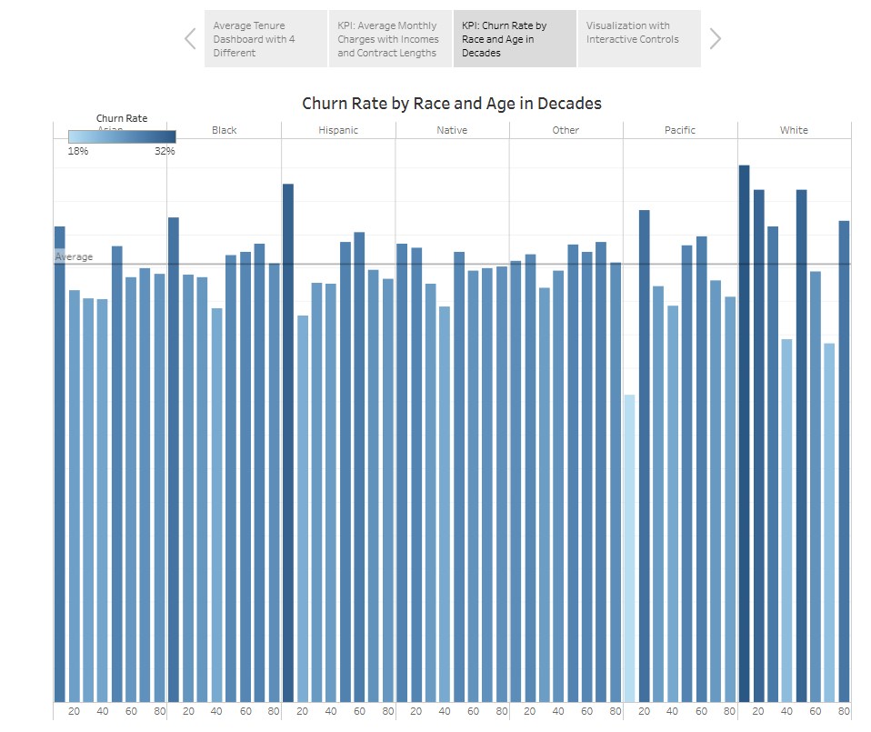
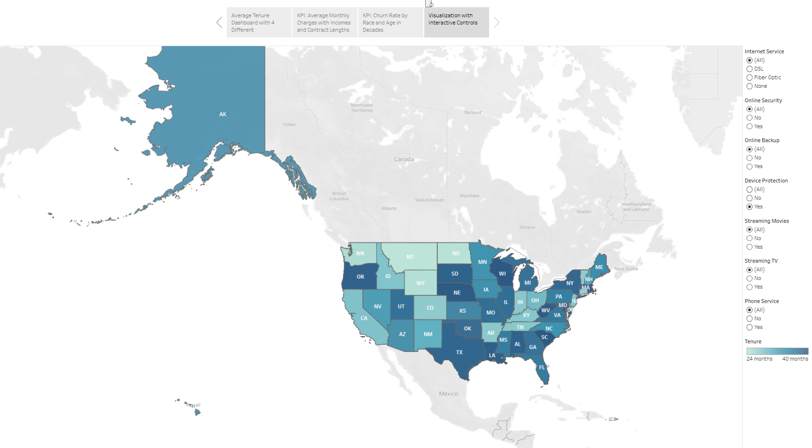

# Customer Tenure & Churn SQL Dashboard 
**TL;DR:** Executive-ready Tableau story + SQL analysis for retention insights (tenure & churn) with interactive filters and KPIs.

## Overview
This project presents a Tableau **dashboard suite and story** analyzing **customer tenure and churn** across demographic and service-based segments. The goal is to provide executive stakeholders with clear, actionable insights into which customers stay longer, and how to better retain those who are likely to leave.

---

## Business Context
Customer churn is expensive — it costs up to **10x more** to acquire a new customer than to retain an existing one.  

This dashboard was designed for a **non-technical executive audience** to help identify:
- Which types of customers stay longer  
- Where churn is happening most (by age, income, location, race, gender)  
- The impact of service bundling on retention  

---

## Tools Used
- **SQL** – for data cleaning and preprocessing  
- **Tableau** – dashboard creation and visualization  
- **WGU Churn Dataset** – core customer data  
- **2015 US Census Demographics** – supplemental dataset for state-level insights  

---

## Dashboard Features
- **Average Tenure by Demographics**  
  Filter by gender, age, income, race, and state population  
  *Insight: Younger customers tend to churn less than older ones*

- **Average Tenure by Service Subscription**  
  View how subscription types affect average tenure  
  *Insight: Customers with more subscribed services have longer tenure*

- **Churn Rate by Age and Race**  
  Compare churn patterns across demographic groups  
  *Insight: Higher churn is seen among older customers*

---

## Accessibility Considerations
- Used shades of the same color for better visibility for users with colorblindness  
- Clear labels and tooltips on every data point  
- No acronyms or jargon — content is understandable by a non-technical audience  

---

## How to View
- 📊 **[View Interactive Dashboard on Tableau Public](https://public.tableau.com/app/profile/crystal.ford/viz/d210_COMPLETE/Story1)**  
  *(Recommended: interactive version — no Tableau Desktop required)*  

- 💻 **Download the Tableau workbook:**  
  [customer_tenure_sql_dashboard.twbx](customer_tenure_sql_dashboard.twbx)  

- 📑 **Preview the static PDF (4 pages, one per story pane):**  
  [customer_tenure_sql_dashboard.pdf](customer_tenure_sql_dashboard.pdf)  

---

## Dashboard Preview

**Average Tenure by State, Income, Gender/Age, and Gender/Race**  

**KPI: Average Monthly Charges with Incomes and Contract Lengths**  

**KPI: Churn Rate by Race and Age in Decades**  

**Visualization with Interactive Controls**  

---

## Key Takeaways
- Customers with **more subscribed services** = **longer tenure**  
- **Older customers churn more** — potential causes include financial strain or lack of service fit  
- Dashboards allow filtering by multiple factors to support **targeted marketing and retention strategies**  

