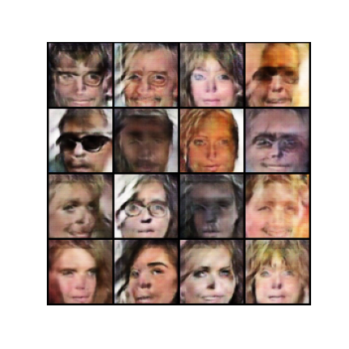

# Image Generation with GANs

This project trains a Deep Convolutional GAN (DCGAN) to generate 64x64 face images using a cropped version of the CelebA dataset.

## Highlights

- PyTorch implementation of Generator and Discriminator
- Trains adversarially on CelebA dataset
- Saves generated samples after each epoch
- Loss curves for model evaluation

## Sample Output

## How to Use

1. Clone this repo  
2. Install dependencies:  
   `pip install -r requirements.txt`
3. Add data:  
   - Unzip `processed-celeba-small.zip` if you have it  
   - Place contents in `processed_celeba_small/celeba/`
4. Run `image_generation_gan.ipynb` in Jupyter or Colab

## Repo Files

- `image_generation_gan.ipynb`: Main training + visualization code  
- `requirements.txt`: Package dependencies  
- `tests.py`: Unit tests for model and data loading  
- `epoch_35.png`: Output sample from trained generator  
- `README.md`: You are here  

## Credits

Created by Crystal Ford  
M.S. Data Analytics – Western Governors University  

- GitHub: [github.com/crystalmford](https://github.com/crystalmford)  
- LinkedIn: [linkedin.com/in/crystalmford](https://www.linkedin.com/in/crystalmford)
