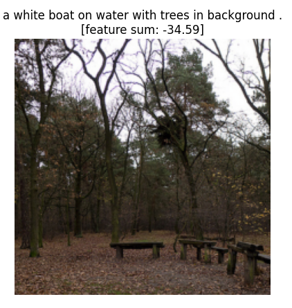
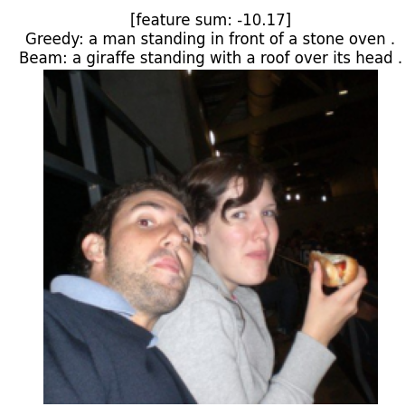

# Image Captioning with CNN-RNN

This project demonstrates how to generate natural language captions for images using a Convolutional Neural Network (CNN) encoder and Recurrent Neural Network (RNN) decoder. The model was trained on the Microsoft COCO 2014 dataset using PyTorch.

> Originally completed as part of Udacity's Computer Vision Nanodegree.

---

## Project Overview

- **Encoder**: Pretrained ResNet-18 to extract image features
- **Decoder**: LSTM network that generates captions from image embeddings
- **Training**: COCO 2014 dataset (subset of 2,000 images used in project)
- **Evaluation**: Greedy decoding vs. beam search (beam width = 5)

---

## Example Outputs

| Input Image | Predicted Caption |
|-------------|-------------------|
|  | *“a boat is on the water with trees in the background”* |
|  | *“a giraffe standing under a roof”* (incorrect) |

---

## Key Learnings

- CNN-RNN pipeline for sequence generation
- Feature extraction from pre-trained networks
- Caption generation using beam search
- Challenges in caption diversity and overfitting

---

## Files

| File | Description |
|------|-------------|
| `image_captioning_cnn_rnn.ipynb` | Final notebook (training, inference, analysis) |
| `model.py` | EncoderCNN and DecoderRNN classes |
| `data_loader.py` | COCO dataset loader and preprocessing |
| `images/` | Screenshots and sample outputs |
| `README.md` | Project overview and instructions |

---

## Getting Started

To run this notebook locally:

1. Clone the repo
2. Install dependencies (e.g., `torch`, `torchvision`, `matplotlib`, `nltk`)
3. Run the notebook using Jupyter or Colab

> Note: COCO dataset and model weights not included due to licensing.

---

## Contact

Feel free to reach out or connect:

- [LinkedIn – Crystal Ford](https://www.linkedin.com/in/crystalmford)
- [GitHub – crystalmford](https://github.com/crystalmford)

---

## Contact

If you’re hiring or would like to collaborate, please connect with me on [LinkedIn](https://www.linkedin.com/in/crystal-m-ford/).
